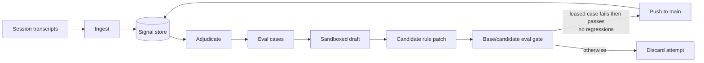
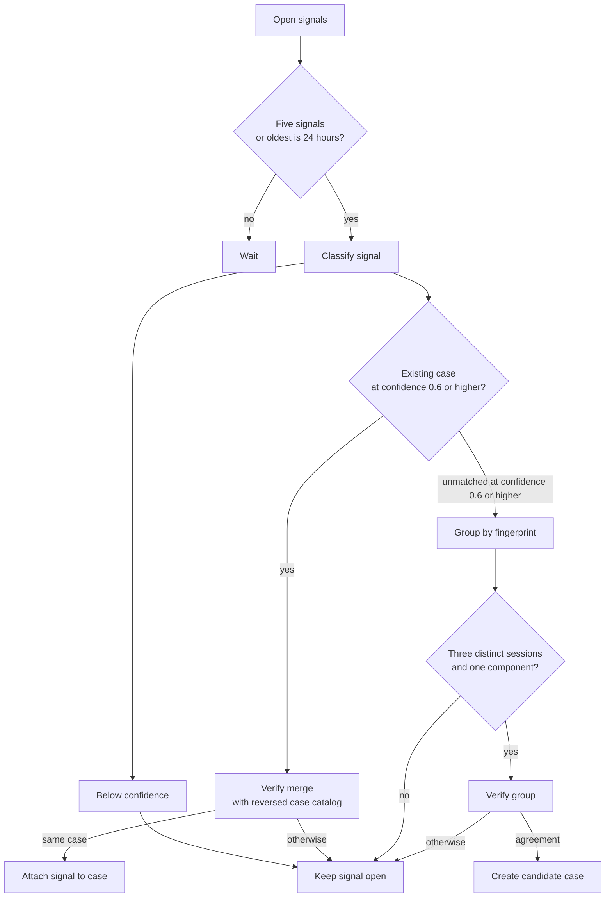
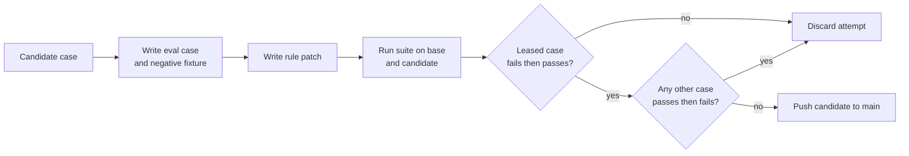

# agent-flywheel

Mines a coding agent's own session transcripts for the corrections its user
keeps making, turns the recurring ones into eval cases, drafts a fix to the
agent's instructions, and commits that fix only if the eval suite still holds.

Unattended. No pull request, no approval step.

## Architecture



### Adjudication



### Draft gate



## The loop

1. **Ingest.** Read session transcripts and extract candidate corrections -
   user turns that push back, paired with the assistant text they answered.
2. **Adjudicate.** A tool-less model merges each open signal into an existing
   case or proposes a new one. A merge needs two independent passes naming the
   same case; a new case needs matching signals from three distinct sessions.
   Ambiguous results stay open for human triage.
3. **Draft.** For one candidate case, two sandboxed model calls in a leased
   git worktree:
   - the first writes the eval case - `case.toml`, a verifier, and a negative
     fixture with the same trigger but the wrong action - and commits it;
   - the second writes the fix, and may read the case but cannot modify it.

   The order is the point. Both calls share a worktree and the drafter can
   read files, so a fix written first would be on disk for the case-writing
   call to find. Drafting the case first makes the independence causal rather
   than a promise in a prompt.
4. **Gate.** Run the whole accumulated suite at the base commit and at the
   candidate. Publish only if the leased case goes fail -> pass *and* no other
   case goes pass -> fail. A case already failing at base is known-open, not
   damage this draft did.
5. **Publish.** A plain, non-forced `git push <sha>:main`. If `main` moved,
   git rejects it and the attempt is discarded.

Why the gate is separate from the drafter at all: when a self-evolving agent
proposes and accepts its own changes, greedy acceptance is uncontrolled
adaptive multiple testing - it p-hacks itself. See
[PACE](https://arxiv.org/abs/2606.08106), which measures 30-42% false commits
under a naive "keep it if the score went up" rule, and
[RSEA](https://arxiv.org/abs/2606.28374) on held-out selection.

## The four seams

A host supplies one implementation of each protocol in `host.py`. These are
the only places the library knows anything about its environment; the store,
the adjudication thresholds, the verdict algebra and the publish step do not.

| Seam | What it decides | Shipped |
|---|---|---|
| `TranscriptSource` | where sessions live and how to parse them | `OmpTranscripts`, `ClaudeTranscripts` |
| `ModelRunner` | how a model is called | `OmpRunner` |
| `Sandbox` | how the drafting subprocess is confined | `MacSandbox`, `NullSandbox` |
| `HostProject` | where agent configuration lives in the repo | `DotfilesHost`, `SimpleHost` |

`Sandbox` covers the drafting subprocess only. It confines writes and leaves
reads open, because enumerating an agent CLI's lookup paths proved unstable
across releases. Eval cases confine themselves separately and more strictly.

## Configuration

`$AGENT_FLYWHEEL_HOME/flywheel.toml`, beside the database it configures:

```toml
[host]
kind = "simple"
repo = "~/projects/my-repo"
evals_root = "specs/agent-evals"
description = "The repository holding this agent's instructions."

[host.stage]
"AGENTS.md" = "AGENTS.md"
".claude" = ".claude"

[sandbox]
kind = "macos"          # or "none", when something coarser already isolates

[[sources]]
kind = "omp"
root = "~/.omp/agent/sessions"
```

With no file present the dotfiles layout is assumed and said so on stderr.
`AGENT_FLYWHEEL_HOME` and `AGENT_FLYWHEEL_STATE` override the state
directories.

## When this does not fit you

**Your agent's rules must be statically checkable.** A structural case is
`python3 check.py .` against a materialised checkout - no agent, no model, no
network. That is what makes the gate trustworthy and cheap. Cases that need a
real agent run are refused outright in autonomous mode: in a recent live run,
3 of 19 cases came back `skipped` for exactly that reason. If your conventions
cannot be expressed as a file-inspecting assertion, you get the mining and the
adjudication, but a much weaker acceptor - and the acceptor is the part that
decides whether self-evolution helps or drifts.

**Your agent's configuration must be a git repository.** The publish step
pushes a commit. If your rules live in a hosted dashboard, half of this is
inert.

**macOS, for now.** The shipped sandbox is `sandbox-exec`. `NullSandbox` is
honest about confining nothing; a Linux implementation over `bwrap` would be
a small addition, and nothing above it would change.

## Prior art

This is a populated field. [TRACE](https://arxiv.org/abs/2606.13174) compiles
user corrections into runtime checks; Microsoft's
[closed-loop framework](https://arxiv.org/abs/2607.13091) accumulates
behavioural rules from accepted review comments;
[claude-reflect](https://github.com/BayramAnnakov/claude-reflect) captures
corrections into `CLAUDE.md` with a human approving each one. What is unusual
here is committing unattended behind a per-rule regression gate - which is
also the part most coupled to a repository you can run checks against.
