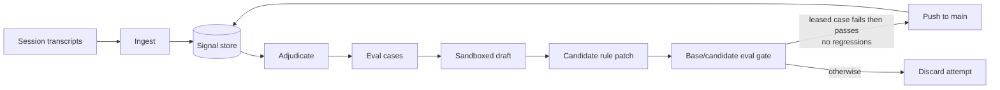
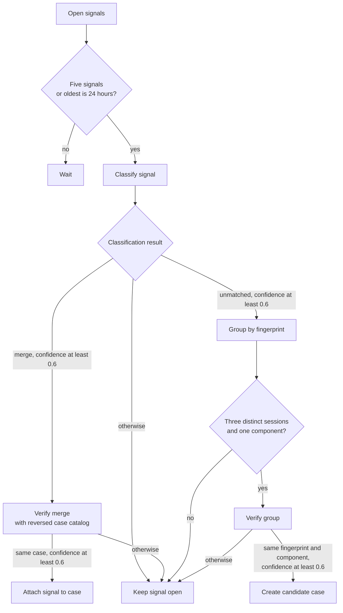
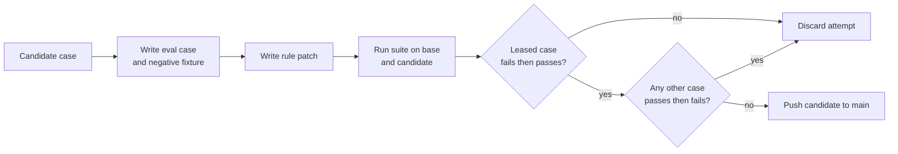

# agent-flywheel

agent-flywheel reads a coding agent's session transcripts for corrections from
the user. It turns repeated corrections into eval cases, drafts changes to the
agent's instructions, and commits a change only when the eval suite still
passes.

It runs unattended. There is no pull request or approval step.

## Features

- Finds repeated user corrections in local coding-agent transcripts.
- Requires an eval case and negative fixture before a rule patch.
- Runs every eval on base and candidate revisions.
- Publishes only when its own case changes from fail to pass and no earlier case regresses.
- Uses a normal, non-forced push, so a moved `main` rejects the attempt.

## Architecture



### Adjudication



### Draft gate



## The loop

1. **Ingest.** Read session transcripts. Extract candidate corrections: user
   turns that push back and the assistant text they answer.
2. **Adjudicate.** A model without tools either merges each open signal into an
   existing case or proposes a new case. A merge needs two independent passes
   that name the same case. A new case needs matching signals from three
   distinct sessions. Ambiguous results remain open for human triage.
3. **Draft.** For each candidate case, two sandboxed model calls run in a
   leased git worktree:
   - First, one writes and commits the eval case: `case.toml`, a verifier, and
     a negative fixture with the same trigger but the wrong action.
   - Second, one writes the fix. It can read the case but cannot change it.

   This order matters. Both calls share a worktree, and the drafter can read
   files. If it wrote the fix first, the case-writing call could find it on
   disk. Writing the case first makes their independence causal, not a prompt
   promise.
4. **Gate.** Run the full accumulated suite at the base commit and candidate.
   Publish only when the leased case changes from fail to pass *and* no other
   case changes from pass to fail. A case that already fails at base is known
   open, not damage caused by this draft.
5. **Publish.** Run a plain, non-forced `git push <sha>:main`. If `main` has
   moved, git rejects the push and the attempt is discarded.

The gate is separate from the drafter because an agent that proposes and
accepts its own changes can greedily accept a better score. That is
uncontrolled adaptive multiple testing: it p-hacks itself. [PACE](https://arxiv.org/abs/2606.08106)
measures 30-42% false commits under a naive "keep it if the score went up"
rule. [RSEA](https://arxiv.org/abs/2606.28374) covers held-out selection.

## The four seams

A host implements each protocol in `host.py`. These are the only places where
the library knows about its environment. The store, adjudication thresholds,
verdict algebra, and publish step do not.

| Seam | What it decides | Shipped |
|---|---|---|
| `TranscriptSource` | where sessions live and how to parse them | `OmpTranscripts`, `ClaudeTranscripts` |
| `ModelRunner` | how to call a model | `OmpRunner` |
| `Sandbox` | how to confine the drafting subprocess | `MacSandbox`, `NullSandbox` |
| `HostProject` | where agent configuration lives in the repo | `DotfilesHost`, `SimpleHost` |

`Sandbox` applies only to the drafting subprocess. It confines writes but
leaves reads open because agent CLI lookup paths changed across releases. Eval
cases have separate, stricter confinement.

## Configuration

Set `$AGENT_FLYWHEEL_HOME/flywheel.toml` beside its database:

```toml
[host]
kind = "simple"
repo = "~/projects/my-repo"
evals_root = "specs/agent-evals"
description = "The repository holding this agent's instructions."

[host.stage]
"AGENTS.md" = "AGENTS.md"
".claude" = ".claude"

[sandbox]
kind = "macos"          # or "none", when something coarser already isolates

[[sources]]
kind = "omp"
root = "~/.omp/agent/sessions"
```

Without this file, agent-flywheel uses the dotfiles layout and reports that on
stderr. `AGENT_FLYWHEEL_HOME` and `AGENT_FLYWHEEL_STATE` override state
directories.

## When this does not fit you

**Your agent's rules must be statically checkable.** A structural case runs
`python3 check.py .` against a materialised checkout. It uses no agent, model,
or network. That makes the gate cheap and trustworthy. Autonomous mode refuses
cases that need a real agent run. In a recent live run, 3 of 19 cases returned
`skipped` for that reason. If you cannot express your conventions as a
file-inspecting assertion, you still get mining and adjudication, but use a
much weaker acceptor. The acceptor decides whether self-evolution helps or
drifts.

**Your agent's configuration must be a git repository.** Publishing pushes a
commit. If your rules live in a hosted dashboard, half the system is inert.

**macOS, for now.** The shipped sandbox uses `sandbox-exec`. `NullSandbox`
honestly confines nothing. A Linux implementation using `bwrap` would be a
small addition; nothing above it would change.

## Prior art

Related work takes different paths from feedback to change.

| Project | Feedback input | Acceptance gate | Publishes to shared Git |
|---|---|---|---|
| **agent-flywheel** | Repeated user corrections in coding-agent transcripts | Eval first; its case must fail then pass; no existing case may regress | Yes, pushes to `main` |
| [TRACE](https://arxiv.org/html/2606.13174#S4) | User correction signals | Rule lifecycle resolver; candidate gate not documented | Not documented |
| [Microsoft closed-loop framework](https://arxiv.org/html/2607.13091#S2) | Accepted review comments | Engineer chooses whether rule generalizes; pull request for shared changes | No |
| [claude-reflect](https://github.com/BayramAnnakov/claude-reflect#how-it-works) | Direct user corrections | User must apply, edit, or skip each rule | No |
| [Darwin Gödel Machine](https://arxiv.org/html/2505.22954#S3) | Benchmark evaluation logs | Automatic archive selection | Not documented |
| [Huxley-Gödel Machine](https://arxiv.org/html/2510.21614#S2) | Benchmark task results | Automatic tree-search selection | Not documented |

agent-flywheel combines transcript mining with an eval-first patch and an unattended regression gate. It needs a repository where checks can run.
